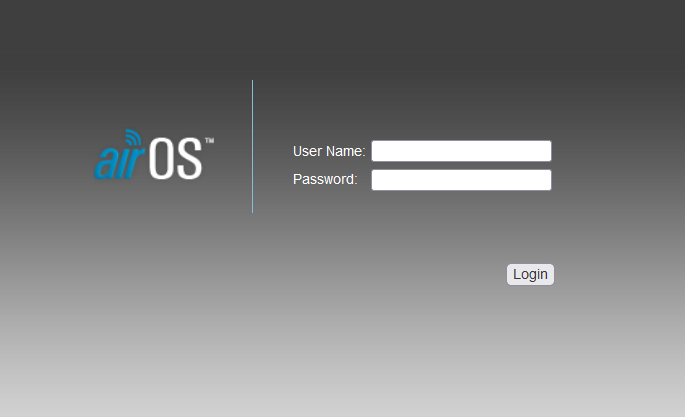
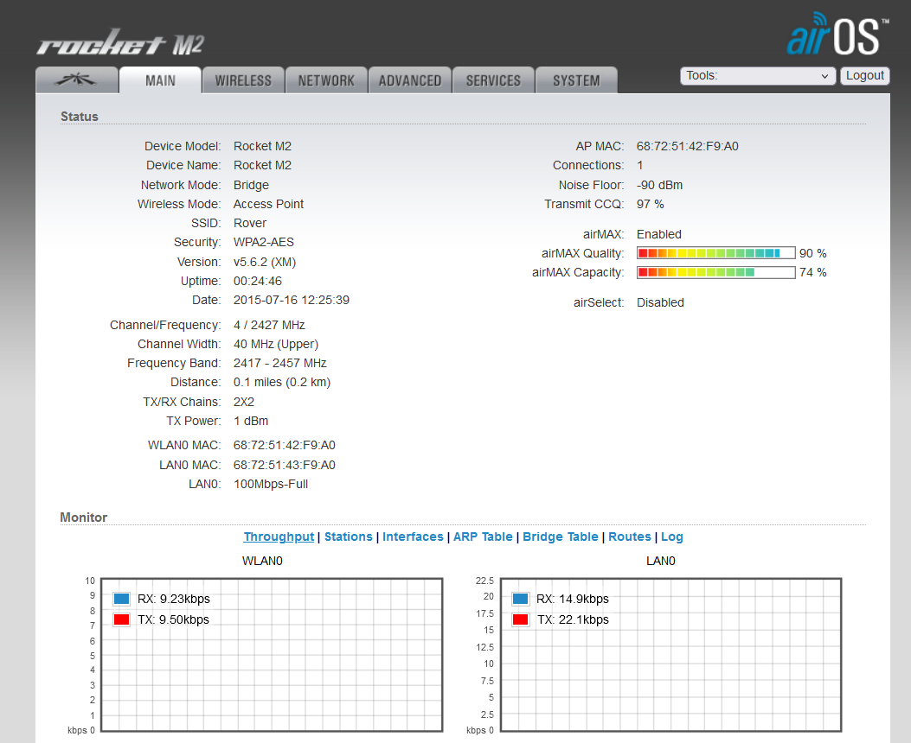
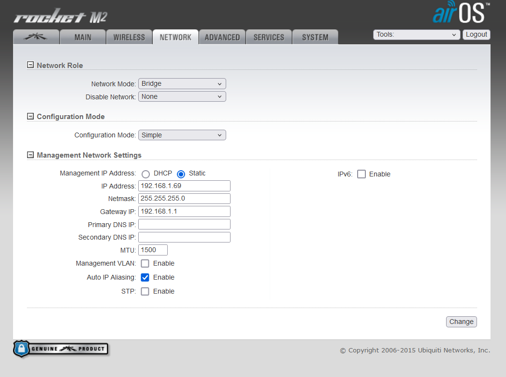
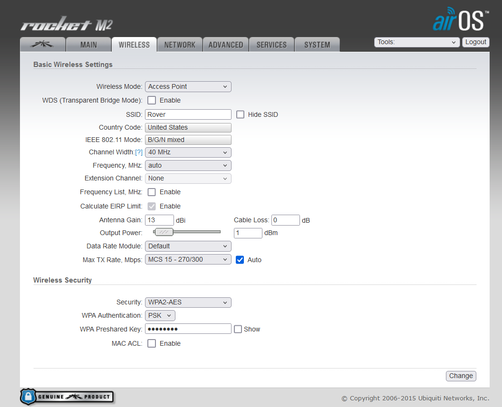
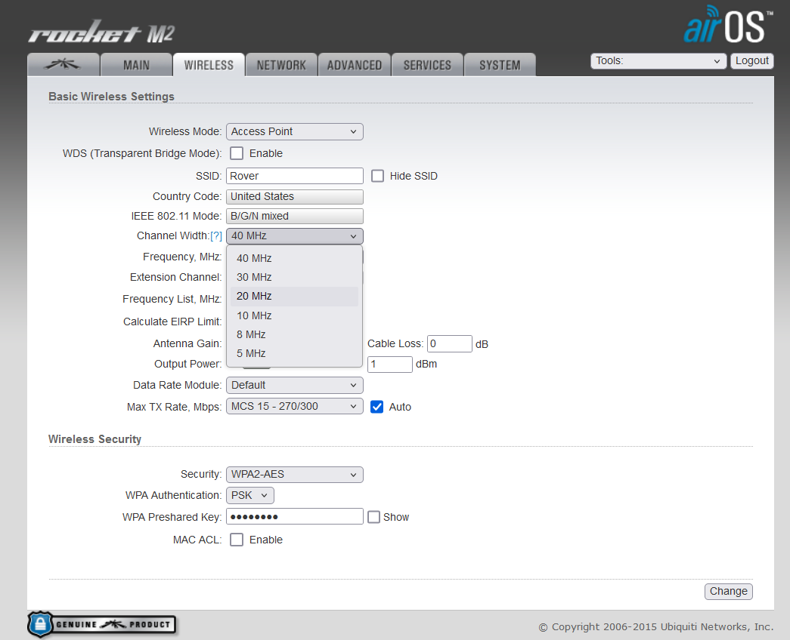

# Rocket M2s

To connect wirelessly across a large distance (1-2km) we are using Ubiquiti Rocket M2s for radios, along with Ubiquiti antennas. The datasheet for the Rocket M2s is included in this directory. They use 2.4 GHz frequency for comms, and have a variable bandwidth of 20-40 MHz. The competition rules state that we cannot have a bandwidth of more than 22 MHz at this frequency, so we will be limiting it to 20 MHz in the Rocket M2 settings.

## Setup

By default, the Rocket M2s broadcast an admin interface on `192.168.1.20`. The default username and password for this admin interface is:

- Username: `ubnt`
- Password: `ubnt`

When you go into a browser and access the web interface directly using the default IP, you should be greeted with a login screen like this:

For simplicities sake, we currently do not change these credentials. We do, however, change the IP. Once you have logged in to the admin page, you shoudl see a screen like this:

To change the IP of the Rocket, we click on the `Network` tab. You should be greeted with a screen like this:

In the middle, we see the broadcasted IP of the Rocket, labeled `IP Address`. Change that to something else. Currently, we have the Rockets labeled with tape. Ensure you are connecting to the correct one and assigning the correct IP. It can be confusing if the IPs get switched. If you are not the main networking engineer, please DO NOT change randomly. Ask someone who knows what to put in.

IMPORTANT: When you change a setting, the settings isn't instantly changed. There is a small button labeled `Change` at the bottom right of the page, shown below:

After you make changes to any settings, the rocket will ask you to `Test` or `Apply` the settings. The `Test` options means that it will apply the new settings for a short period of time and prompt you with a confirmation pop-up. If you don't confirm the confirmation pop-up, the settings will revert, to make sure you never change a setting and immediately lose access irriversibly. The `Apply` option will immediately apply the settings, without asking for confirmation. Be sure you know exactly what you're doing if you want to click `Apply` rather than `Test`.

__Bandwidth__

To change the bandwidth, we look in another section in the top navbar, called `Wireless`. After clicking the `Wireless` settings section, you should see something like this:

The setting we want is called `Channel Width`. By default, this is set to auto (will pick between 20-40 MHz) or 40 MHz, depending on wireless mode. We need to set this to 20 MHz only in order to comply with competition standards. 

REMEMBER: You will need to change this setting on ALL radios in use, whether they are Ubiquiti, Mikrotik, or something else. You NEED to make sure the channel width is less than the competition regulation.

## Individual Rocket Setup

Now that we know how to configure the Rockets, we need to specify how to select the proper settings for each Rocket.

__Base Station__
For the base station the settings are as follows:

***Wireless***
- Wireless Mode: `Bridge`
- Channel Width: `20 MHz`
- SSID: `Rover`
- Security: `WPA2-AES`
- WPA Authentication: `PSK`
- WPA Preshared Key: `password`

__Rover__
For the Rover station the settings are as follows:

- Wireless Mode: `Station`
- Channel Width: `20 MHz`
- SSID: `Rover`
- Security: `WPA2-AES`
- WPA Authentication: `PSK`
- WPA Preshared Key: `password`