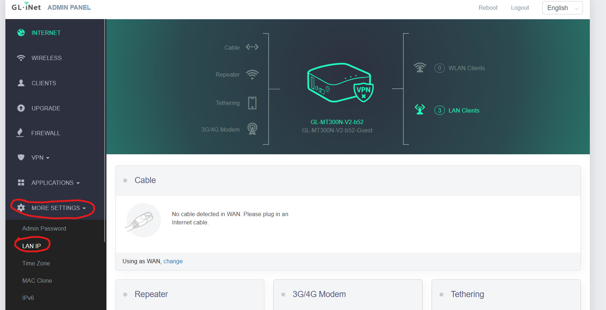
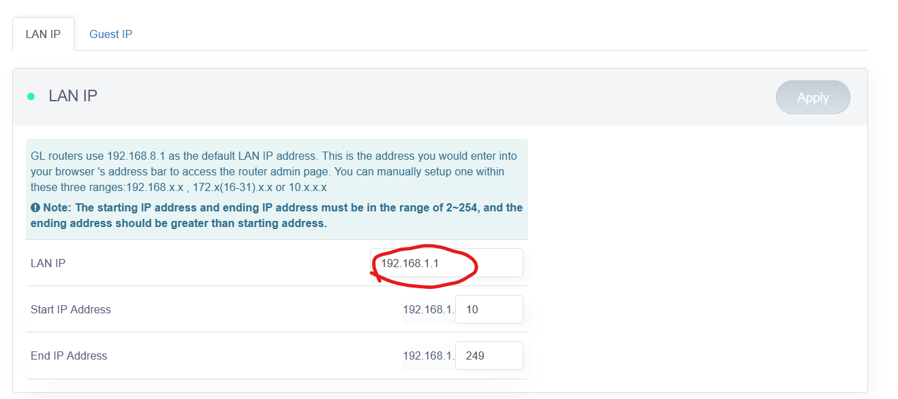

# Router

The router we are currently using is a small travel router. This is used to easily create a network we can use to send data between devices and manage DHCP for devices we add to the network. [This link](https://docs.gl-inet.com/router/en/3/setup/mini_router/first_time_setup/) is the setup page for the router, which describes possible configurations and settings for the router. 

## Setup

By default (after factory reset), the router uses the network `192.168.8.x`. It hosts its admin portal at `192.168.8.1`. After a factory reset, you will have to set default settings such as country and admin password.

We set the admin password to `password`, because it is easy to remember and we don't really need to have strong security for our purposes. In an adversarial environment, it would be good to stop the broadcasting of the SSID and change the password to something very hard. A key-based connection could also be used, rather than password authentication.

__Admin Password__
- Password: password

In order to make things more default, we change the default subnet the router resides on to `192.168.1.x`. To do this, visit the admin page, and on the left, scroll through the setting until you see the `Advanced Settings` dropdown. Under the `Advanced Settings` dropdown, select `LAN IP`.

Once you are in the `LAN IP` settings, you can change the default IP `192.168.8.1` to `192.168.1.1`. This helps with setting up the Ubiquiti Rocket M2s that we are currently using for radio connection between the Rover/Drone/Base Station, which will broadcast their admin page on `192.168.1.20` by default.

### SSID settings

Currently, we are not using the wireless capabilities of this router (we plan to replace the wifi router with a pi configured to route signals via ethernet at some point). As a result, the credentials can be set to whatever, especially since generally speaking, we do not need to worry about bad actors since we aren't broadcasting continuously and we aren't doing anything classified.

By default, we set WiFi credentials to this:

__Wifi__
- SSID: Rover
- Password: Password

## Troubleshooting and Reset

The troubleshooting page for the router is located [here](https://docs.gl-inet.com/router/en/2/troubleshooting/reset/). It includes steps for repairing and reseting the router software settings. If a factory reset is needed, and you are not the head network engineer, DO NOT ATTEMPT YOURSELF. Speak to whoever is in charge of networking (currently Ethan Morton) first.