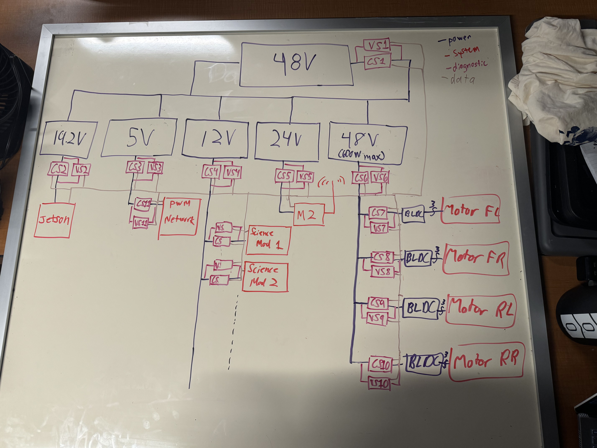

# Saturday September 7th - Kubas Notes and Thoughts

This week the main focus was getting a plan hatched and trying to decide on hardware. The team got a rough idea of the plan and scope of what we want to do with the power system shown in the whiteboard picture below.

This overall plan was agreed upon by the end of the meeting. Ethan had spent a lot of time drawing the diagram and adding sensors where we would want them. (side note: the voltmeters are referenced to ground). He then began the documentation of the networking setup we used last semester and planned on its continued use. 

Issac worked with the Arm Team to help in the decision-making process for the motors and servos they wanted to use. The Arm guy is at it again!

Alvin with his team worked on getting [Altium](https://www.altium.com/) installed, getting a plan hatched for onboarding of current and a new member, and using the Spring 2024 Prototype as a base for what's to come. Gabe was assigned to design circuitry to convert the 48V battery into the 12V and 24V lines while Leyton was assigned the design of the 19.2V and 5V lines.

I worked to communicate between team leads to establish a basis for what the proposed electrical components would be. The chassis team wanted to go with hub motors instead of the conventional DC motors we had used previously. Nick found [Brushless DC Hub Motors](https://odriverobotics.com/shop/botwheels) for our use which fit our power draw limit. I asked the Science team to get a list of probable components they might use and asked Issac, Sophie, and the Arm team to look into the possibility of using 48V (preferred) or 12V motors if at all possible. 

Great start to the semester with some good progress being made. I hope this productivity continues!
